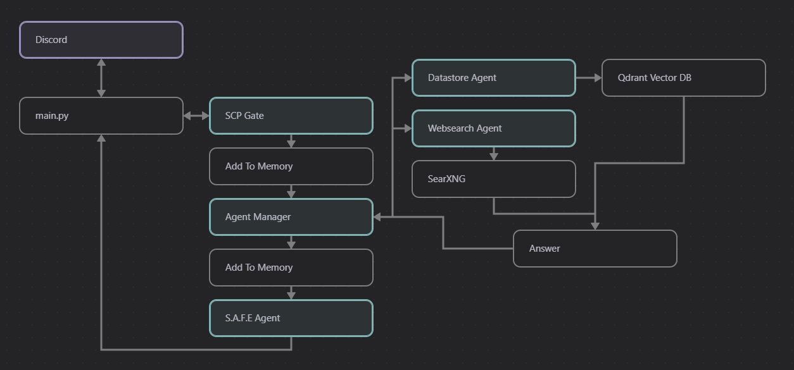

```

   ___|        \        ____|  ____| 
 \___ \       _ \       |      __|   
       |     ___ \      __|    |   
 _____/ _) _/    _\ _) _| _)  _____| 
                               

```

S.A.F.E.(Secure Artificial Foundation Engine), an advanced artificial intelligence system designed to assist in accessing and analyzing classified SCP Foundation data.

#### What is SCP?

The SCP Foundation is a fictional organization featured in stories created by contributors on the SCP Wiki, a wiki-based collaborative writing project. Within the project's shared fictional universe, the SCP Foundation is a secret organization that is responsible for capturing, containing, and studying various paranormal, supernatural, and other mysterious phenomena (known as "anomalies" or "SCPs"), while also keeping their existence hidden from the rest of society.

#### What is S.A.F.E?

S.A.F.E is a discord bot that takes on the role of an AI developed by the SCP Foundation.

#### How does it work?

S.A.F.E uses the discord python module to interact with a server. When users mention S.A.F.E it listens, and depending on the user query, will respond accordingly.

S.A.F.E has a gate keep protocol that will deny requests that are not SCP related, and will generate an in-universe style access denied message.

If the user query is related to SCP the messages passes to the Agent Manager who routes it to one of two agents, one that can respond from  a vector database built on SCP data, and one that can perform web-searches.

Finally all data is routed through the S.A.F.E agent which puts it in character and formats it.


